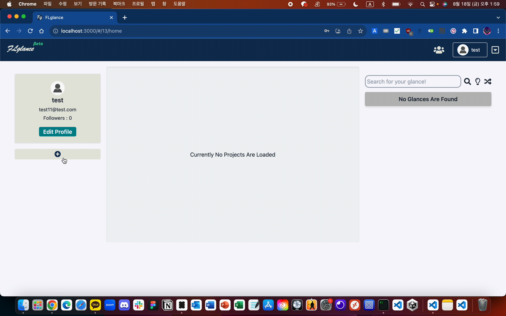
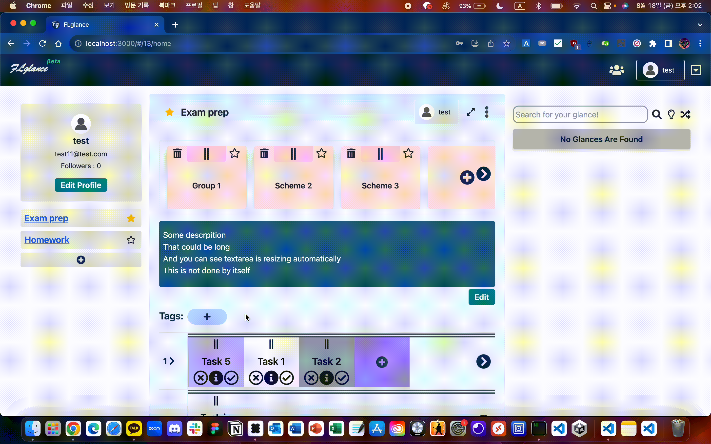
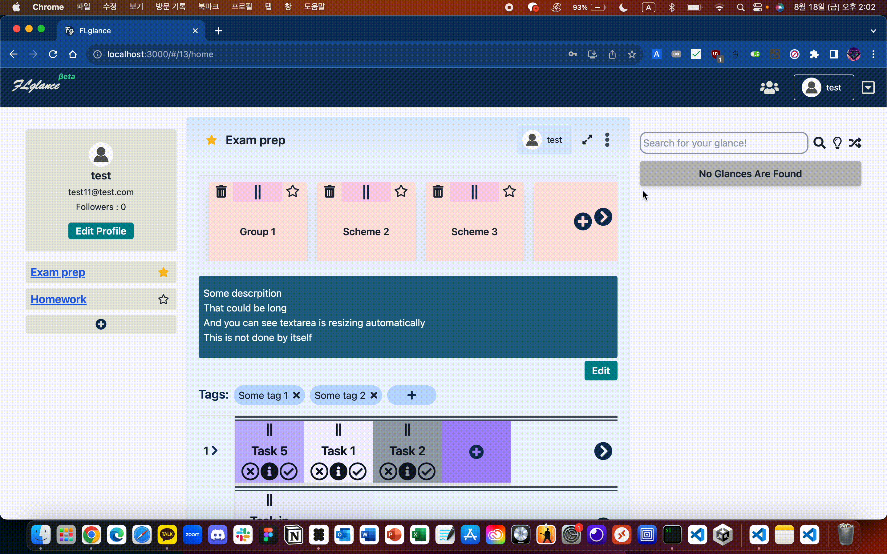
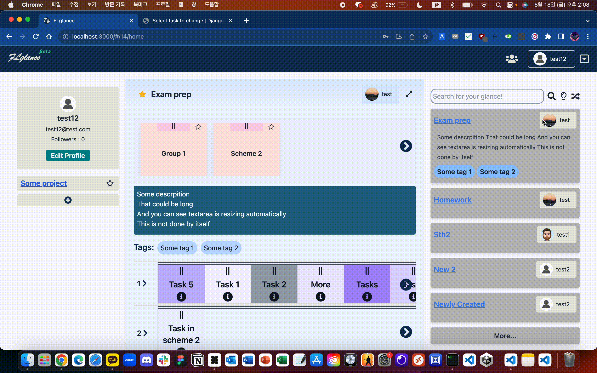
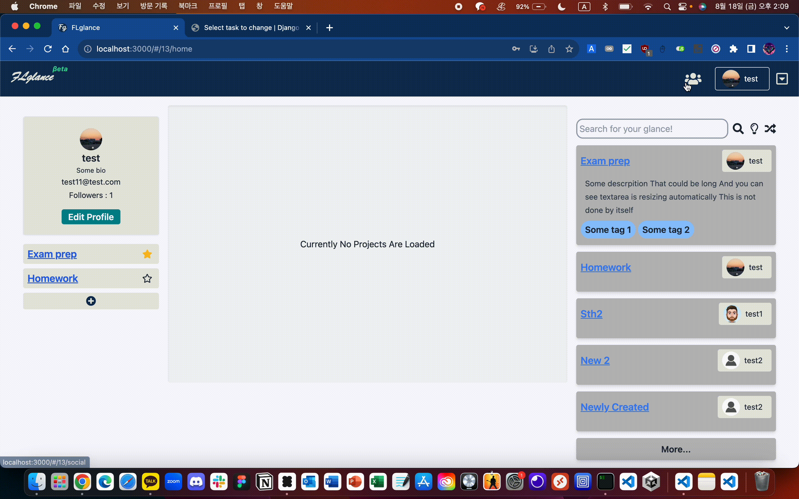

# FLGlance

"TODO 에 SNS 기능이 추가되면 재밌지 않을까?" 하는 생각에 시작한 프로젝트.


작성자가 클론 코딩 등으로 웹 개발을 배운 후 처음으로 "작성자의 온전한 기획, 디자인, 개발을 통해 만든 프로젝트" 라는 점에서 본 프로젝트는 의의가 있으며, 처음으로 "서비스를 개발, 출시 및 운영" 할 수 있었던 경험이기도 합니다.


서비스 출시의 결론은 아무도 안쓰는 웹서비스가 되어버렸지만… 확실히 본 프로젝트를 진행하면서 단순 클론 코딩이나 각종 강좌들 만으로는 배울 수 없는, "실제 프로젝트를 진행하면서 겪는 문제들"을 경험하고 해결해 나가는 과정을 통해 많은 것을 배울 수 있었습니다. ([Key Takeaways](#key-takeaways) 참조)

# Program Overview

상술했듯이 본 애플리케이션은 크게 아래 2가지 기능을 가지고 있습니다.

- TODO 기능
  - Project를 생성할 수 있고, 이 Project 아래에 Task 등을 만들어 관리합니다.
  - Kanban Board 형태를 차용해 Drag and drop을 통한 TODO 조작이 가능합니다.
- SNS 기능
  - Private으로 설정하지 않은 Project는 다른 사용자들에게 공개됩니다.
  - 타 사용자는 자신의 Project와 Project에 포함된 Task를 열람할 수 있습니다.
  - 인스타그램처럼 사용자 간의 팔로우/팔로잉 관계를 형성할 수 있습니다.

## Showcase: Desktop

### Basic pages

Landing Page | Sign Up & Sign In
:---: | :---:
 | 

### Content Creations

Create Projects | Create Tasks | Create Tags
:---: | :---: | :---:
 |  | 

### Dashboard Manipulations

Extend & Shrink | Private & Public | Drag and drop
:---: | :---: | :---:
 |  | 

Drag and drop & Simple Animations | Edit project description
:---: | :---:
 | 

### User interactions

Edit profile | Glance others' projects
:---: | :---:
 | 

Follow others | Accept follow requests
:---: | :---:
 | 

## Showcase: Mobile

Landing Page | Project & Details | Glance others' projects
:---: | :---: | :---:
 |  | 

# Getting Started

## Prerequisites

- [Node.js](https://nodejs.org/en/) v15 or lower. v12 is recommended.
- Python version 2 for package installation.

## Setup

### Frontend

```bash
# Use python version 2.
# This example uses python2.7 with conda.
conda create -y -n python2 python=2.7
conda activate python2

# Install dependencies with python2,
# using versions specified at package-lock.json file.
npm ci --python=python # conda enrivonment `python2` will set `python` command as python2.

# Run development server.
npm run start
```

### Backend

```bash
# This project uses pipenv for package management.
# It's quite legacy, but we need to use it as the project is based on it.
pip install pipenv --user

# Install dependencies using versions specified at Pipfile.lock file.
pipenv install --ignore-pipfile

# Run development server.
pipenv run python manage.py runserver
```


# Lessons

## 창업의 관점에서의 교훈

본 프로젝트는 (무모하게도) 시작 자체가 "이 아이템으로 대박을 내겠어!" 라는 일종의 비전에서 시작되었기 때문에, 본 프로젝트를 바라보는데 창업의 관점이 포함될 수 밖에 없었습니다. 

창업의 관점에서, 본 프로젝트를 진행하면서 얻은 가장 큰 교훈은, 

> [!IMPORTANT]\
> 시장의 수요가 없으면, 소비자의 니즈에 부합하지 않는 프로덕트는 아무리 열심히 만들었다 해도 잘 될 수 없다

였습니다. 


어찌보면 당연한 소리지만 이 프로덕트에 열정을 들이부었던 저에게는 매우 큰 교훈이었다고 할 수 있습니다. 


저는 프로덕트 완성 이후 Facebook 등의 SNS, 그리고 지인 네트워크를 활용한 본 서비스의 마케팅을 진행했습니다.


이때까지는 본 서비스가 매우 좋은 서비스임에 의심이 없었고, 그래서 마케팅을 통해 서비스를 알리면 자연스럽게 많은 사람들이 서비스를 사용할 것이라고 생각했습니다.


그러나 이는 매우 큰 오산이었습니다.


마케팅을 통해 서비스를 알린 결과, 서비스를 사용해본 사람들의 반응은 대부분 "아, 이런 서비스가 있었구나" 였습니다.


또한 본 서비스를 사용해보겠다고 한 저의 지인들은 대부분 사용도 해보지 않거나, 사용을 한다 하더라도 금세 관심을 잃어버렸습니다.


이러한 반응을 보고 저는 본 서비스가 시장에서의 수요가 없다는 것을 깨달았습니다.


이 프로덕트에 굉장한 시간적 노력을 들였던 저로써는 매우 좌절스러운 결과였지만, 그렇기에 더더욱 "수요"의 중요성을 제 머릿 속에 각인할 수 있었던 것 같습니다.


그래서 이때부터 어떤 프로젝트를 기획하려고 할 적에는 항상 시장조사 먼저 진행하는 등, 시장의 수요를 확인하기 위한 작업을 먼저 진행하는 것 같습니다.


그리고 관련해 현재는 시장의 수요를 확인하는 여러가지 방법론 (e.g. 린 스타트업의 방법론, 린 고객 개발에서 주장하는 방법론, ...)을 공부하며 이를 여러 곳에 실제로 적용하고 있습니다.


## 기술적 관점에서의 교훈

사실 이 부분은 창업적 관점에서도 적용될 수 있는 교훈입니다. 진부한 말이지만,

> [!IMPORTANT]\
> 포기하지 말 것.

이라는 교훈을 얻었습니다.


우선 본 프로젝트는 (그 당시의 나에게는) 방대한 양의 코드를 짜면서 구글링 스킬, 리엑트와 관련 라이브러리 (리덕스 등)에 대한 스킬을 포함하는 FE 지식 및 스킬, 장고, SQL, AWS에 대한 스킬을 포함하는 BE 및 DEVOPS 지식 및 스킬 또한 방대한 양으로 쌓였던 프로젝트였습니다.


이러한 큰 폭의 성장은, 막연히 여러 동기부여 서적이나 창업 서적에서 언급하는 "포기하지 말 것" 이라는 말을 프로젝트를 진행하면서 계속 상기했기 때문이 아닌가 회고합니다.


그 당시 저는 완벽한 소프트웨어를 만들어야 한다는 이상한 강박관념에 갖혀있었습니다.
저는 웹앱 배포로 Elastic Beanstalk과 같은 managed 서비스가 아닌, EC2와 Docker, Nginx를 이용한 manual deployment를 진행하는 것이 진정한 실력자인 것이다라고 생각했습니다. (이와 관련한 [메뉴얼](./deployment-checklist.md)도 작성했습니다.) 


약간 C++ 코드 작성하는 사람들이 Python 무시하는 것과 비슷하다고 할 수 있습니다. (물론 이게 맞는 말은 절대 아닙니다.)


지금 회상해보면 한 편으로는 굉장히 고통스러웠지만, 포기하지 않았기에 결론적으로는 굉장히 좋은 경험을 할 수 있었습니다. 


이를 통해 blue green deployment, ssh, 환경 변수, 내부 IP 및 외부 IP 등 서버와 네트워크와 관련한 많은 지식을 쌓았던 것으로 회고합니다.


### Why psycopg2 keep spitting out this error?

위 교훈에 대한 가장 대표적인 예시를 하나 꼽자면, PostgreSQL을 DB로 사용하는 Django 프로젝트를 EC2 에 배포하는 과정에서 무려 3일간 밤낮없이 디버깅을 했던 경험을 꼽을 수 있습니다.


`psycopg2` 와 python docker image의 compatibility issue를 해결하느라 3일을 쏟은 경험이 있는데, stackoverflow에 관련한 질문을 올렸으나 아무도 해결할 수 있는 사람이 없어 결국 3일동안의 삽질 끝에 제가 해결하고 말았습니다. 그리고 이는 현재 stackoverflow에 질문으로 게시되어 있고, 6000번의 뷰가 있었습니다.


> [Why psycopg2 keep spitting out this error?](https://stackoverflow.com/questions/66254669/why-psycopg2-keep-spitting-out-this-error/66261371)


### Why psycopg2 keep spitting out this error?: The Story


Django에서 PostgreSQL을 사용하기 위해서는, psycopg2라는 라이브러리를 설치해야 합니다.


작성자는 [Dockerfile](./backend/Dockerfile)을 작성하여 PostgreSQL을 사용하는 Django 서버를 배포하려고 시도하였는데, 이때 아래와 같은 에러가 발생합니다. (실제 에러는 아래보다 훨씬 길고 보기 싫은 에러였습니다 :/)

```bash
Error: pg_config executable not found.
```

처음에는 영문도 모른채 에러 로그를 읽고 구글링을 하였고, 그때 당시까지만 해도 이 에러를 디버깅하는데 3일이 걸릴 줄은 몰랐습니다.


위에서 언급한 stackoverflow 페이지를 보면 제가 여러 시도를 했다는 것을 볼 수 있습니다. 정말 여러 자료를 읽어봤고, 그럼에도 불구하고 위 문제는 계속 해결되지 않았습니다.


그러다 문득 Dockerfile에 별 의심없이 넣어두었던 `FROM python:3.8.5-alpine` 이라는 코드가 정확히 어떤 것을 의미하는지에 관한 의문을 가지게 되었습니다. (이 전까지는 FROM directive 아래에 있는 코드에만 집중했습니다.)


이에 대한 의문을 가지고 구글링을 해보니, `FROM python:3.8.5-alpine` 은 python 3.8.5 버전을 사용하는 alpine linux를 사용한다는 것을 알게 되었습니다.


`alpine` 버전은 다른 distribution에 비해 가장 lightweight한 버전이며, 서버 구동에 필요한 정말 최소한도의 패키지만을 포함하고 있다는 사실을 알게 되었습니다.


이때 "뭔가 alpine distribution에는 없는 빌드툴이 있어서 자꾸 오류가 나는 것 같은데" 하는 생각을 하게 되었고, 결과적으로 이 생각이 맞았습니다. De-facto python docker image를 활용하기 위해 `FROM python:3.8.5`로 첫 줄을 변경하였고, 이로써 3일에 걸친 삽질을 끝내고 말았습니다.


이러한 삽질의 과정을 겪으면서 정말 고통스러웠지만, 이때의 경험이 제가 지금까지 개발을 포기하지 않고 우직하게 계속 해올 수 있게 해준 밑바탕이 되었다고 저는 확신합니다. 그래서 이때 개발을 포기하지 않은 나 자신이 고맙고, "포기하지 말 것"이라는 교훈은 지금도 업무나 개인 개발 시 상기하고 있으며, 비단 개발에만 국한된 것이 아닌 다른 일에도 적용하고 있습니다.

